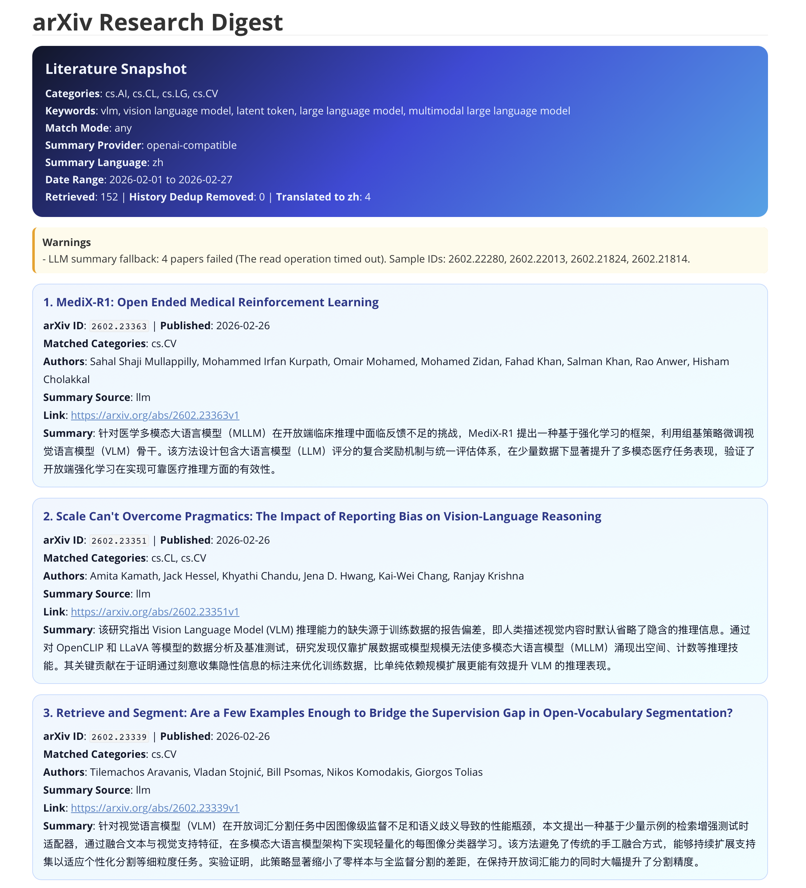

# PaperMOSS
Name: arxiv-cs-ai-digest \
项目描述: 根据用户提供的关键词，从 arXiv 检索并汇总一个或多个类别（例如 cs.AI、cs.CL、cs.LG、cs.CV）中的论文，并返回带有链接的 arXiv ID。适用于用户请求多主题文献监测、并行跨类别搜索、生成摘要或使用第三方 LLM API 生成简洁摘要。\
Description: Fetch, filter, and summarize arXiv papers for user-provided keywords across one or more categories (for example cs.AI, cs.CL, cs.LG), and return arXiv IDs with links. Use when users ask for multi-topic literature monitoring, parallel cross-category search, digest generation, or concise summaries using a third-party LLM API.
---

# ArXiv CS.AI Digest

## Overview

Use this skill to search multiple arXiv categories in parallel, filter by multiple keywords, and generate concise summaries with either extractive logic or an OpenAI-compatible third-party LLM API.

## Overview


## Workflow

1. Confirm categories (one or more) and topic keywords (one or more), plus optional constraints (`max-results`, `min-date`, and match mode).
2. Run `scripts/arxiv_cs_ai_digest.py` with those inputs.
3. Return one item per paper with title, arXiv ID, publish date, link, and concise summary.

## Run Command

```bash
python3 scripts/arxiv_cs_ai_digest.py \
  --category cs.AI,cs.CL,cs.LG,cs.CV \
  --keyword "your keyword" \
  --mode any \
  --date-from yy-mm-dd \
  --date-to yy-mm-dd \
  --max-results 50 \
  --summary-provider openai-compatible \
  --summary-language zh \
  --llm-api-base "your api url" \
  --llm-api-key "your api key" \
  --llm-model "your model" \
  --llm-max-papers 200 \
  --llm-timeout 30 \
  --output markdown \
  --markdown-theme colorful \
  --save-markdown ./ \
  --verbose
```

## Output Contract

- Include the arXiv identifier as a bare ID, for example `2502.01234`.
- Keep each summary concise and avoid reproducing the full abstract.
- Report an explicit no-result message when no paper matches.
- If `openai-compatible` summarization fails for some papers, fall back to extractive summaries and report warnings.

## Parameters

- `--keyword`: Repeatable topic keyword. Each flag can also contain comma-separated items.
- `--mode`: `any` or `all`, controlling keyword matching in title plus abstract.
- `--category`: Repeatable arXiv category. Each flag can also contain comma-separated items.
- `--category-workers`: Parallel workers for category-level search.
- `--max-results`: Number of entries requested per category.
- `--min-date`: Optional lower bound (`YYYY-MM-DD`) for publication date.
- `--summary-sentences`: Number of extracted sentences in summary.
- `--summary-max-chars`: Hard limit for summary length.
- `--summary-provider`: `extractive` or `openai-compatible`.
- `--summary-language`: LLM summary language (`zh` or `en`).
- `--llm-api-base` / `--llm-api-key` / `--llm-model`: Third-party OpenAI-compatible API configuration.
- `--llm-workers`: Parallel workers for LLM summarization.
- `--llm-max-papers`: Upper bound of papers sent to LLM.
- `--output`: `markdown` or `json`.
- `--save`: Optional output file path.

## Notes

- Use `mode=all` for narrow topic tracking and `mode=any` for broad scouting.
- Use multiple `--category` values for cross-field retrieval (for example cs.AI + cs.CL + cs.LG).
- Load `references/arxiv-api-notes.md` when arXiv query behavior needs deeper guidance.
- Load `references/llm-api-notes.md` when wiring a third-party LLM provider.